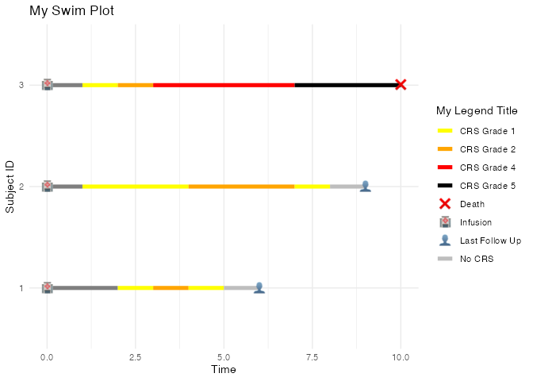

<!-- README.md is generated from README.Rmd. Please edit that file -->

# ggswim

<p align="center">


</p>
<!-- badges: start -->

[](https://lifecycle.r-lib.org/articles/stages.html#experimental)
[](https://github.com/CHOP-CGTInformatics/ggswim/actions/workflows/R-CMD-check.yaml)
<!-- badges: end -->

The ggswim package provides an easy set of commands to create “swimmer”
plots.

## Installation

You can install the development version of ggswim like so:

``` r
devtools::install_github("CHOP-CGTInformatics/ggswim")
```

## Example

Below is a simple example for how to set up your “swim table” to pass
along to `ggswim()`:

``` r
library(ggswim)

df <- tibble::tribble(
  ~subject_id, ~time, ~event,
  1, 0, "Infusion",
  1, 2, "CRS Grade 1",
  1, 3, "CRS Grade 2",
  1, 4, "CRS Grade 1",
  1, 5, "No CRS",
  1, 6, "Last Follow Up",
  2, 0, "Infusion",
  2, 1, "CRS Grade 1",
  2, 4, "CRS Grade 2",
  2, 7, "CRS Grade 1",
  2, 8, "No CRS",
  2, 9, "Last Follow Up",
  3, 0, "Infusion",
  3, 1, "CRS Grade 1",
  3, 2, "CRS Grade 2",
  3, 3, "CRS Grade 4",
  3, 7, "CRS Grade 5",
  3, 10, "Death"
)

df
#> # A tibble: 18 × 3
#>    subject_id  time event         
#>         <dbl> <dbl> <chr>         
#>  1          1     0 Infusion      
#>  2          1     2 CRS Grade 1   
#>  3          1     3 CRS Grade 2   
#>  4          1     4 CRS Grade 1   
#>  5          1     5 No CRS        
#>  6          1     6 Last Follow Up
#>  7          2     0 Infusion      
#>  8          2     1 CRS Grade 1   
#>  9          2     4 CRS Grade 2   
#> 10          2     7 CRS Grade 1   
#> 11          2     8 No CRS        
#> 12          2     9 Last Follow Up
#> 13          3     0 Infusion      
#> 14          3     1 CRS Grade 1   
#> 15          3     2 CRS Grade 2   
#> 16          3     3 CRS Grade 4   
#> 17          3     7 CRS Grade 5   
#> 18          3    10 Death
```

We’ll also pre-define some arguments of interest and the plot
accordingly:

``` r
lanes <- c("CRS Grade 1", 
           "CRS Grade 2", 
           "CRS Grade 3", 
           "CRS Grade 4", 
           "CRS Grade 5", 
           "No CRS")

lane_colors = c("yellow", "orange", "pink", "red", "black", "gray")

markers <- list(
  "Last Follow Up" = "👤", 
  "Death" = "❌",  
  "Infusion" = "🏥"
)

df |>
  ggswim(id = subject_id,
         time = time,
         events = event,
         reference_event = "Infusion",
         emoji_or_shape = "emoji",
         markers = markers,
         lanes = lanes,
         lane_colors = lane_colors,
         title = "My Swim Plot",
         xlab = "Time",
         ylab = "Subject ID",
         legend_title = "My Legend Title")
```


