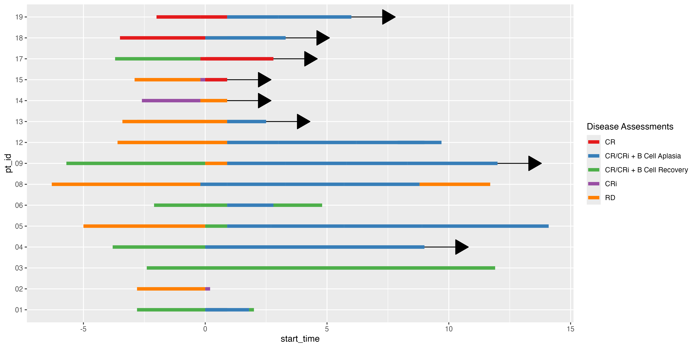

<!-- README.md is generated from README.Rmd. Please edit that file -->

# ggswim

<p align="center">


</p>
<!-- badges: start -->

[](https://lifecycle.r-lib.org/articles/stages.html#experimental)
[](https://github.com/CHOP-CGTInformatics/ggswim/actions/workflows/R-CMD-check.yaml)
[](https://app.codecov.io/gh/CHOP-CGTInformatics/ggswim?branch=main)
<!-- badges: end -->

The ggswim package provides a convenient set of commands to easily
create “swimmer” plots.

## Installation

⚠️ ggswim is in its very early stages, but in active development!⚠️

Expect to see many changes in the near future to the API and
documentation.

You can install the development version of ggswim like so:

``` r
devtools::install_github("CHOP-CGTInformatics/ggswim")
```

## Background

ggswim provides developers with a set of commands that make it easy to
create beautiful swimmer plots using the architecture they may already
be familiar with in ggplot2. The main functions that power ggswim are
wrapped around core ggplot2 functions, leveraging the ability to add
layers at a whim for whatever the developer’s display requires.

The ggswim package reduces the complexity behind making reproducible
legend displays that correctly show points of interest and are key to
telling the story of the swimmer plot.

Let’s show a quick example of how this works below!

## A Sample Data Set

ggswim comes packaged with a sample dataset called `patient_status`,
which is a list containing 3 tibbles:

- `patient_status`
  - `patient_status` has already been prepared in a way that makes it
    easy to use with ggswim, but may not be very representative of how
    one receives data in the wild
- `adverse_events`
- `medication_administration`

Each of these tibbles are also available to call individually. Let’s
load the data and get ready to swim!

``` r
library(ggswim)

ggswim(
  data = patient_status,
  mapping = aes(
    x = value,
    y = subject_id,
    fill = cohort
  )
) +
  add_marker(
    data = adverse_events,
    mapping = aes(
      x = time_of_event,
      y = subject_id,
      color = adverse_event_name,
      shape = adverse_event_name
    ),
    size = 5
  ) +
  add_marker(
    data = medication_administration,
    mapping = aes(
      x = time_of_event,
      y = subject_id,
      label = medication,
      color = name
    ),
    label.size = NA, fill = NA, size = 5
  ) +
  ggplot2::labs(x = "Time", y = "Subject ID", color = "Markers") +
  ggplot2::ggtitle("My Swim Plot") +
  ggplot2::scale_color_manual(
    name = "Markers",
    values = c("firebrick", "forestgreen", NA, NA, "purple")
  ) +
  ggplot2::scale_shape_manual(
    name = "Markers",
    values = c(19, 13, 9)
  ) +
  ggplot2::scale_fill_manual(
    name = "Lanes",
    values = c("steelblue1", "goldenrod1")
  ) +
  theme_ggswim()
```


