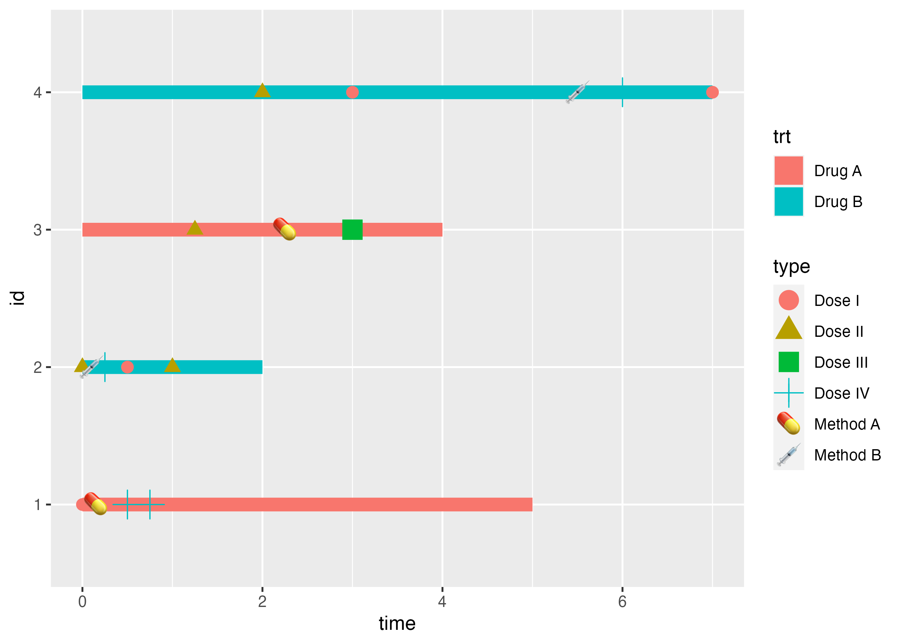
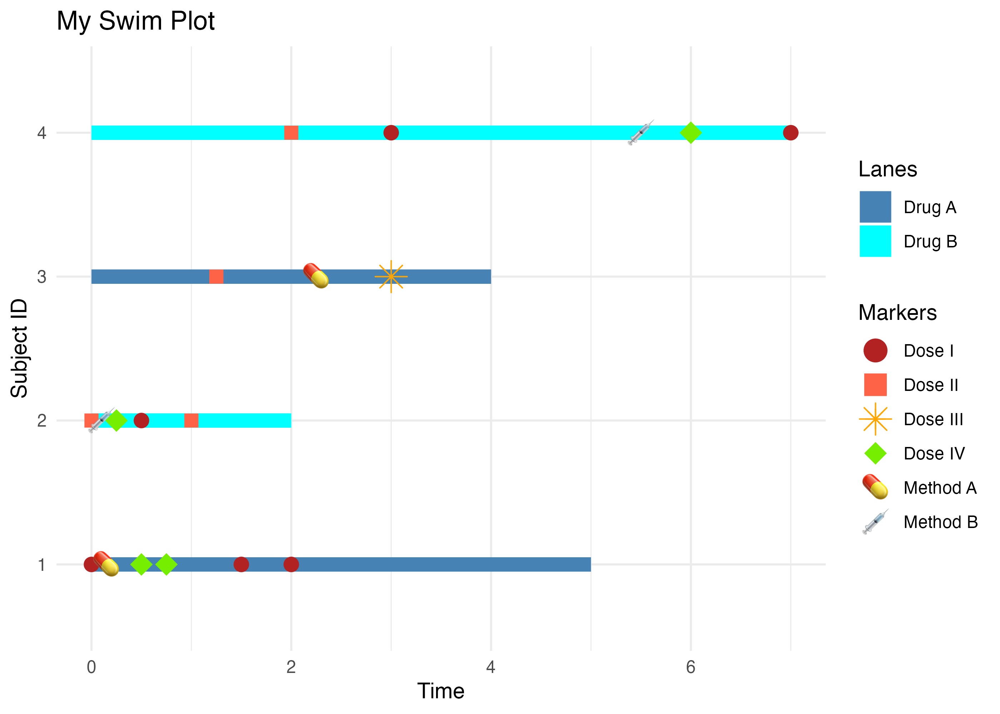
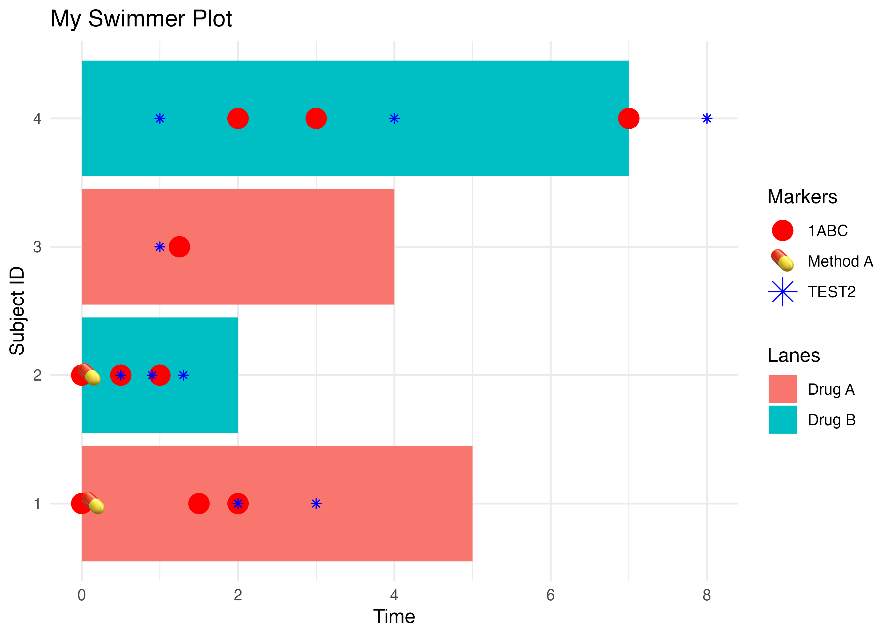

<!-- README.md is generated from README.Rmd. Please edit that file -->

# ggswim

<p align="center">


</p>
<!-- badges: start -->

[](https://lifecycle.r-lib.org/articles/stages.html#experimental)
[](https://github.com/CHOP-CGTInformatics/ggswim/actions/workflows/R-CMD-check.yaml)
<!-- badges: end -->

The ggswim package provides an easy set of commands to create “swimmer”
plots.

## Installation

You can install the development version of ggswim like so:

``` r
devtools::install_github("CHOP-CGTInformatics/ggswim")
```

## Background

At it’s core, the ggswim package leverages the already fantastic
capabilities of ggplot2 and seeks to preserve as much of the flexibility
and structure that it provides as possible. Therefore, when using ggswim
you will likely notice that much of the documentation and underlying
functionality wrap it! So what makes it different? ggswim provides some
opinionated decisions to steer plots and the data provided in a way that
makes swimmer plots easily accessible and easy to build upon.

Let’s start with some simple examples of how this works.

## A Sample Data Set

First we’ll define a few sets of data to work with:

- `patient_data`: a dataframe containing per-patient, record-level data
- `dose_data_a`: a dataframe with two doses corresponding to multiple
  potential time points for the patients in `patient_data`

``` r
set.seed(123)
patient_data <-
  tibble::tibble(
    id = 1:4,
    trt = rep_len(c("Drug A", "Drug B"), length.out = 4),
    time_to_last_followup = c(5,2,4,7),
    time_to_death = ifelse(id %% 2, time_to_last_followup, NA),
    end_time = c(5,2,4,7)
  )

dose_data_a <- tibble::tibble(
  id2 = c(1,1,1,2,2,2,3,4,4,4),
  type = sample(c("Dose I", "Dose II"), 10, replace = TRUE),
  time = c(0,1.5,2,0,0.5,1,1.25,2,3,7)
)
```

Now, let’s give `patient_data` a start time of 0 and pivot the table to
assign time frames under a `time` column:

``` r
patient_data <- patient_data |>
  dplyr::mutate(time_start = 0) |>
  tidyr::pivot_longer(cols = c(time_start, time_to_last_followup),
                      values_to = "time",
                      names_to = "treatment_group")
```

We’re ready to swim! `ggswim()` requires the following mapping
aesthetics: `x`, `y`, and `fill` and we’ll tack on a static `width` for
good measure:

``` r
library(ggswim)
library(ggplot2)

p <- patient_data |> 
  ggswim(
    aes(y = id,
        x = time,
        fill = trt), width = 0.1
  )

p
```


Awesome! Now let’s throw on some event-specific points, what we’ll call
“markers,” given to us in `dose_data_a`. Notice here that we can add the
new data just like a regular ggplot2 series of calls. You’ll also notice
the colors aren’t quite what we want right now, but we’ll resolve that
later.

`add_marker()`, like `ggswim()`, has a set of requires aesthetic
mappings as well: `x`, `y`, and `color`. But you can provide others as
well, like `shape`.

``` r
p <- p +
  add_marker(data = dose_data_a,
             mapping = aes(
               x = time,
               y = id2,
               shape = type,
               color = type
             ), size = 3)

p
```


What if we have multiple marker datasets? Let’s define and tack on
`dose_data_b`:

``` r
dose_data_b <- tibble::tibble(
  id3 = c(1,1,2,3,4),
  type2 = sample(c("Dose III", "Dose IV"), 5, replace = TRUE),
  time = c(0.5, 0.75, 0.25, 3, 6)
)

p <- p +
  add_marker(data = dose_data_b,
             mapping = aes(
               x = time,
               y = id3,
               shape = type2,
               color = type2,
             ), size = 5)

p
```


Voila! The next set of markers has been added.

## Adding Labels and Emojis

Let’s get extra fancy, let’s say instead of using shapes to depict
markers we want to use emojis. `add_marker()` supports those as well! So
long as an additional column is provided to the required aesthetic
mapping `label`. We’ll showcase this using a new data set called
`dose_type` to add on to our existing plot:

``` r
dose_type <- tibble::tibble(
  id4 = c(1,2,3,4),
  label = c("💊", "💉", "💊", "💉"),
  name = c("Method A", "Method B", "Method A", "Method B"),
  time = c(.15, 0.1, 2.25, 5.5)
)

p <- p + 
  add_marker(
    dose_type,
    aes(x = time,
        y = id4,
        label = label,
        color = name),
    label.size = NA, fill = NA, size = 5
  )

p
```



Wow!

## Making the Plot Pretty

Recall earlier that we said ggswim makes use of existing ggplot2
architecture. This means you can use your favorite manipulators to make
your ggswim objects look however you please. Below, we take the
pre-existing plot, `p`, and supply some beautification steps before
rendering:

``` r
p +
  ggplot2::labs(x = "Time", y = "Subject ID", color = "Markers") +
  ggplot2::ggtitle("My Swim Plot") +
  ggplot2::theme_minimal() +
  ggplot2::scale_color_manual(name = "Markers",
                              values = c("firebrick", "tomato", "orange", "chartreuse2", NA, NA)) +
  ggplot2::scale_shape_manual(name = "Markers",
                              values = c(19,15,8,18)) +
  ggplot2::scale_fill_manual(name = "Lanes",
                             values = c("steelblue", "cyan", "skyblue", "steelblue4"))
#> Scale for colour is already present.
#> Adding another scale for colour, which will replace the existing scale.
```



You’ll notice in the call to `scale_color_manual()` we had to supply
`NA` values for the labels, we explain that more in the upcoming
vignette and hope to provide a better handling method in the future.

## Alternative Approach: One-at-a-Time Markers

Let’s say that instead of mapping aesthetic values in your data, you
have a structure that is more conducive to adding one marker at a time.
This approach is allows for a more direct declaration of values via
static aesthetics (versus mapped ones). Let’s make an example below by
first setting up some reference data:

For this approach, we must supply a `name` for the marker value that
will appear in the legend since we are no longer defining a mapped
color. Now let’s try supplying a few different calls and see how ggswim
responds:

- `color`/`colour` differences
- Different static values
- Supply of different names

``` r
patient_data |>
  dplyr::mutate(time_start = 0) |>
  tidyr::pivot_longer(cols = c(time_start, time_to_last_followup),
                      values_to = "time",
                      names_to = "treatment_group") |>
  ggswim(
    aes(y = id,
        x = time,
        fill = trt)
  ) +
  add_marker(
    data = dose_data_a,
    mapping = aes(x = time, y = id2, name = "1ABC"), colour = "red", size = 5
  ) +
  add_marker(
    data = dose_data_b,
    mapping = aes(x = time, y = id2, name = "TEST2"), color = "blue", shape = 8
  ) +
  add_marker(
    data = dose_type_a,
    mapping = aes(x = time, y = id4, label = label, color = name),
    label.size = NA, fill = NA, size = 5
  ) +
  ggplot2::labs(x = "Time", y = "Subject ID", color = "Markers", fill = "Lanes") + 
  ggplot2::ggtitle("My Swimmer Plot") +
  ggplot2::theme_minimal()
#> Warning: Duplicated aesthetics after name standardisation: colour
#> Duplicated aesthetics after name standardisation: colour
```



Note that it is better to clean your data ahead of time and to limit the
amount of varying behavior you introduce between `add_marker()` calls.
The following issues are known:

- Missing data in a layer followed by a layer with complete data will
  remove the missing data from the legend
- The legend title for one-at-a-time markers defaults to the first value
  in the legend
  - This can be resolved by updating the `color` and `fill` arguments in
    `ggplot2::labs()`

### Future Plans

We have a lot of work to do with ggswim! Future plans include:

- A full test suite
- Enforced checks
- Handling of fixed legend scales
- Vignettes and documentation
