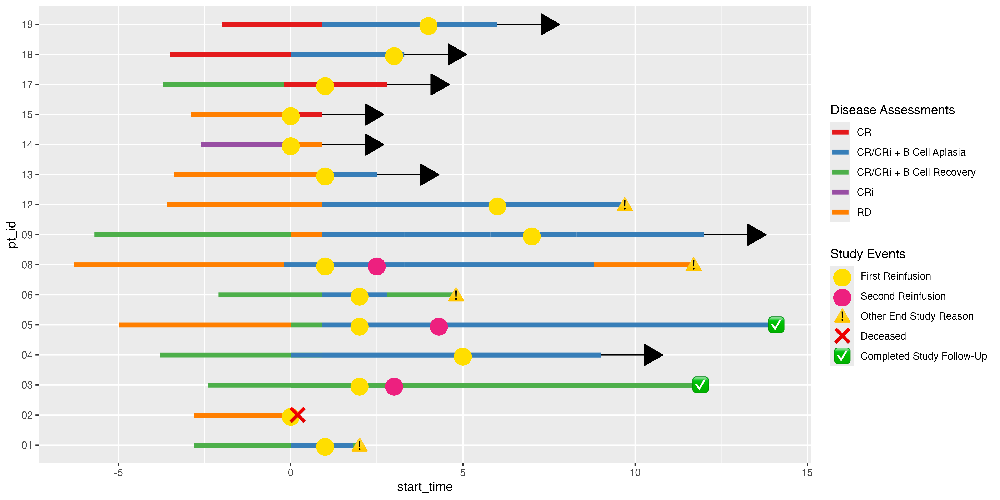
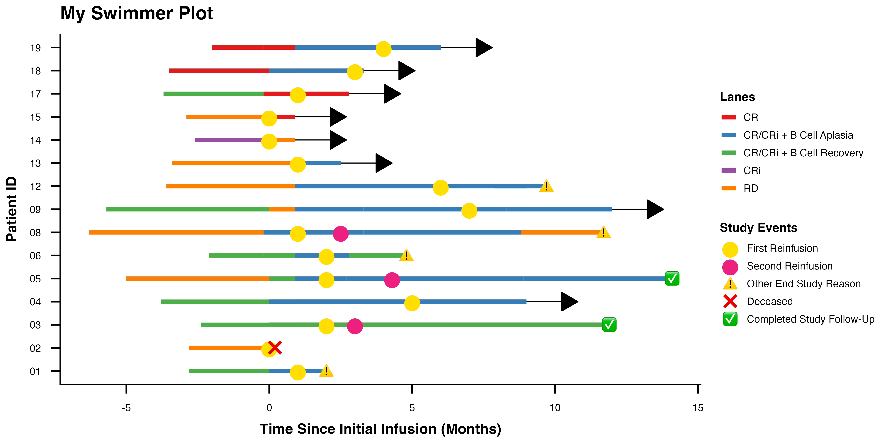

<!-- README.md is generated from README.Rmd. Please edit that file -->

# ggswim <a href="https://chop-cgtinformatics.github.io/ggswim/"></a>

<!-- badges: start -->

[](https://lifecycle.r-lib.org/articles/stages.html#experimental)
[](https://github.com/CHOP-CGTInformatics/ggswim/actions/workflows/R-CMD-check.yaml)
[](https://app.codecov.io/gh/CHOP-CGTInformatics/ggswim?branch=main)
<!-- badges: end -->

The ggswim package provides a convenient set of commands to easily
create swimmer plots. It integrates with the familiar ggplot2 framework
and streamlines the process of generating legends that effectively
communicate events of interest along individual subject trajectories.

ggswim solves some of the headaches associated with layer management in
ggplot2 by leveraging the
[ggnewscale](https://eliocamp.github.io/ggnewscale/) package and
presenting an optimized workflow to get a swimmer plot.

## Installation

You can install the development version of ggswim like so:

``` r
devtools::install_github("CHOP-CGTInformatics/ggswim")
```

## Usage

To help you get started, ggswim includes three sample datasets:
`patient_data`, `infusion_events`, and `end_study_events`. These
de-identified datasets simulate real world data related to infusions,
disease assessments, and study statuses for a clinical trial.

ggswim offers several geom-functions, and by using `geom_swim_lane()` we
can set up the horizontal survival bars of our swimmer plot, i.e. the
“lanes”. We’ll also set up corresponding arrows to indicate subjects
that are still on the trial:

``` r
library(ggswim)
library(ggplot2)

p <- patient_data |>
  ggplot() +
  geom_swim_lane(
    mapping = aes(
      x = start_time, y = pt_id, xend = end_time,
      color = disease_assessment
    )
  ) +
  geom_swim_arrow(
    data = arrow_data,
    mapping = aes(xend = end_time, y = pt_id)
  ) +
  scale_color_brewer(
    name = "Overall Disease Assessment",
    palette = "Set1"
  )

p
```


Next we’ll add on events of interest: end of study updates, and
infusions. We’ll refer to these as “markers” and call them with two more
geom-functions: `geom_swim_point()` and `geom_swim_label()`.

``` r
p <- p +
  new_scale_color() +
  geom_swim_point(
    data = infusion_events,
    aes(x = time_from_initial_infusion, y = pt_id, color = infusion_type),
    size = 5
  ) +
  geom_swim_label(
    data = end_study_events,
    aes(x = time_from_initial_infusion, y = pt_id, label_vals = end_study_label, label_names = end_study_name),
    label.size = NA, fill = NA, size = 5
  )

p
```



Finally, we’ll beautify the plot with familiar ggplot2 techniques and a
last finishing touch with `theme_ggswim()`:

``` r
p +
  scale_color_brewer(name = "Markers", palette = "Set2") +
  labs(title = "My Swimmer Plot") +
  xlab("Time Since Infusion (Months)") + ylab("Patient ID") +
  theme_ggswim()
```



## Collaboration

We invite you to give feedback and collaborate with us! If you are
familiar with GitHub and R packages, please feel free to submit a [pull
request](https://github.com/CHOP-CGTInformatics/ggswim/pulls). Please do
let us know if ggswim fails for whatever reason with your database and
submit a bug report by creating a GitHub
[issue](https://github.com/CHOP-CGTInformatics/ggswim/issues).

Please note that this project is released with a Contributor Code of
Conduct. By participating you agree to abide by its terms.
