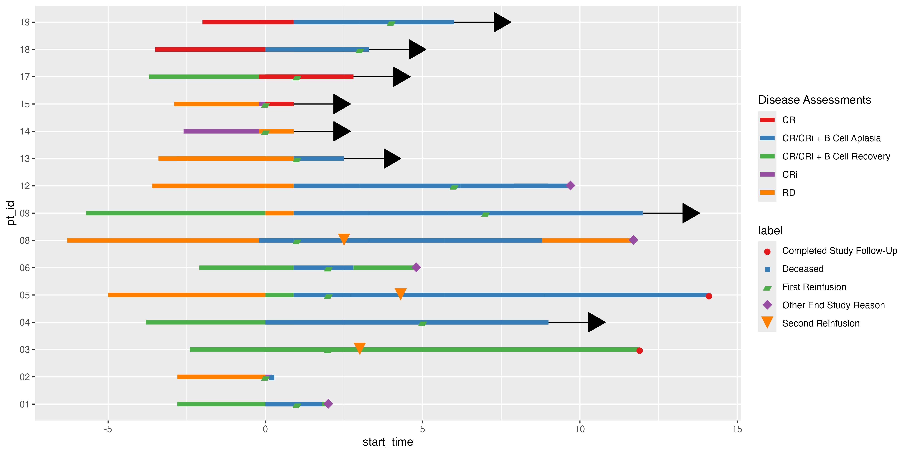

<!-- README.md is generated from README.Rmd. Please edit that file -->

# ggswim <a href="https://chop-cgtinformatics.github.io/ggswim/"></a>

<!-- badges: start -->

[](https://lifecycle.r-lib.org/articles/stages.html#experimental)
[](https://github.com/CHOP-CGTInformatics/ggswim/actions/workflows/R-CMD-check.yaml)
[](https://app.codecov.io/gh/CHOP-CGTInformatics/ggswim?branch=main)
<!-- badges: end -->

The ggswim package provides a convenient set of commands to easily
create swimmer plots. As an extension of ggplot2, it streamlines the
process of generating legends that effectively communicate events of
interest along subject response paths.

ggswim solves some of the headaches associated with layer management in
ggplot2 by organizing and classifying data into “markers” and “lanes.”
While nothing changes about the data itself, the way it’s presented
winds up being much closer to what’s expected to communicate a swimmer
plot’s contents.

## Installation

You can install the development version of ggswim like so:

``` r
devtools::install_github("CHOP-CGTInformatics/ggswim")
```

## Usage

To help you get started, ggswim includes three sample datasets:
`patient_data`, `infusion_events`, and `end_study_events`. These
de-identified datasets simulate real world data related to infusions,
disease assessments, and study statuses for a clinical trial.

ggswim offers several geom-functions, and by using `geom_swim_lane()` we
can set up the horizontal response paths of our swimmer plot, i.e. the
“lanes”. We’ll also set up corresponding arrows to indicate subjects
that are still on the trial:

``` r
library(ggswim)
library(ggplot2)

# Construct arrow_data for arrow display later
arrow_data <- patient_data |>
    dplyr::left_join(
      end_study_events |>
        dplyr::select(pt_id, label),
      by = "pt_id"
    ) |>
    dplyr::select(pt_id, end_time, label) |>
    dplyr::filter(.by = pt_id, end_time == max(end_time)) |>
    dplyr::filter(is.na(label)) |>
    unique()

p <- patient_data |>
  ggplot() +
  geom_swim_lane(
    mapping = aes(
      x = start_time, y = pt_id, xend = end_time,
      colour = disease_assessment
    )
  ) +
  geom_swim_arrow(
    data = arrow_data,
    mapping = aes(xend = end_time, y = pt_id)
  ) +
  scale_colour_brewer(
    name = "Disease Assessments",
    palette = "Set1"
  )

p
```


Next we’ll add on events of interest: end of study updates and
infusions. We’ll refer to these as “markers” and call them with the next
main “geom” function: `geom_swim_marker()`. While it is often common to
see these datasets as separate components in the wild, we’ll make our
lives a little easier during plotting by combining them first.

``` r
all_events <- dplyr::bind_rows(
  infusion_events,
  end_study_events
)

p <- p +
  geom_swim_marker(
    data = all_events,
    aes(x = time_from_initial_infusion, y = pt_id, marker = label),
    size = 5
  )

p
```



This looks OK as a default, but it’s not quite as nice as we’d like it
to be. Let’s specify that we have particular `glyph`s and `colour`s we’d
like to use for the markers with ggswim’s `scale_marker_discrete()`.

``` r
p <- p +
  scale_marker_discrete(glyphs = all_events$glyph, 
                        colours = all_events$colour, 
                        limits = all_events$label, 
                        name = "Study Events")

p
```


Using the custom `marker` `aes()` in `geom_swim_marker()` in combination
with specific scale definitions helps us keep the markesr and lanes
separate in the legend. Finally, we’ll beautify the plot with familiar
ggplot2 techniques and a last finishing touch with `theme_ggswim()`:

``` r
p +
  scale_colour_brewer(name = "Lanes", palette = "Set1") +
  labs(title = "My Swimmer Plot") +
  xlab("Time Since Infusion (Months)") + ylab("Patient ID") +
  theme_ggswim()
```


## Collaboration

We invite you to give feedback and collaborate with us! If you are
familiar with GitHub and R packages, please feel free to submit a [pull
request](https://github.com/CHOP-CGTInformatics/ggswim/pulls). Please do
let us know if ggswim fails for whatever reason with your use case and
submit a bug report by creating a GitHub
[issue](https://github.com/CHOP-CGTInformatics/ggswim/issues).

Please note that this project is released with a Contributor Code of
Conduct. By participating you agree to abide by its terms.
